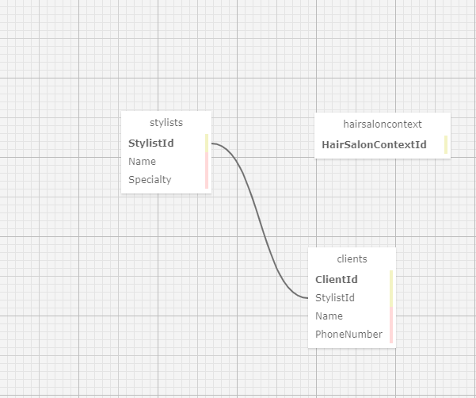

# Eau Claire Hair Salon

#### Friday project for Epicodus to practice using mySql, 4/21/2021

#### By AndrewMickel

## Description

  You've been referred by Pierre to his friend Claire who is the owner of a hair salon called Eau Claire's Salon. She has contracted you out to create an MVC web application to help her manage her employees (stylists) and their clients. Claire should be able to add a list of stylists working at the salon, and for each stylist, add clients who see that stylist. The stylists have specific specialties, so each client can only see (belong to) a single stylist.

  User Stories
  As the salon owner, I need to be able to see a list of all stylists.
  As the salon owner, I need to be able to select a stylist, see their details, and see a list of all clients that belong to that stylist.
  As the salon owner, I need to add new stylists to our system when they are hired.
  As the salon owner, I need to be able to add new clients to a specific stylist. I should not be able to add a client if no stylists have been added.

## Technologies used

- C# v 7.3
- .NET Core v 2.2
- dotnet script, REPL
- Razor
- Entity Framework
- MySQL
- MySQL Workbench
- Bootstrap Library

## Installation Requirements

### Software Requirements
• A code editor like [VSCode](https://code.visualstudio.com/download)
• With [.NET Core 2.2](https://dotnet.microsoft.com/download/dotnet-core/thank-you/sdk-2.2.106-macos-x64-installer) installed
• A browser like [Chrome](https://www.google.com/chrome/)

#### From the web
1. Go to this [GitHub Repo Page](https://github.com/AndrewMMickel/HairSalon.Solution.git).
2. Click the "Code" and click the 'Download zip' option.
3. Unzip the file and navigate to `HairSalon.Solution` directory
4. Type in `dotnet restore` to download necessary packages
5. Then type in `dotnet run` and if the local host does not open automatically type link into browser window.
6. Navigate through the site by clicking links.

--or--

#### From Terminal

1. In terminal type `git clone https://github.com/AndrewMMickel/HairSalon.Solution.git`
2. Navigate to the directory in the terminal (`cd HairSalon.Solution`)
3. Type in `dotnet restore` to download necessary packages
4. Then type in `dotnet run` and if the local host does not open automatically type link into browser window.
5. Navigate through the site by clicking links.

#### Setting Up Your Database

1. In MySQl Workbench go to Administration Window, then select Data Import/Restore
2. In Import Options select Import from Self-Contained File
3. navigate to the .sql file in the project
4. Under Default Schema to be Imported To, select the New button. Enter the name as andrew_mickel
5. Click *Start Import*
## Known Bugs

No known bugs.

## Support and contact details

Feel free to contact <andrew.m.mickel@gmail.com>

### Legal, or License

_MIT_ Copyright (c) 2021 *_Andrew Mickel_*